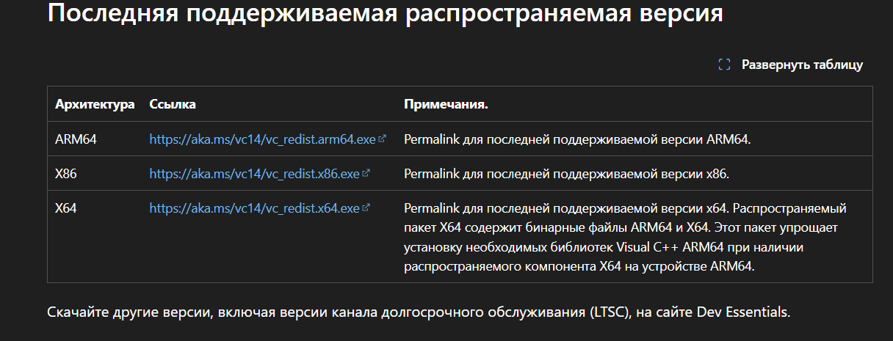

1. Удостоверьтесь, что вы не вытаскивали приложение Ryujinx из папки publish, это приложение должно всегда находиться в этой папке, т.к. в ней находятся все необходимые библиотеки, к которым обращается Ryujinx

2.  [скачать Visual C++ Redistributable](https://learn.microsoft.com/ru-ru/cpp/windows/latest-supported-vc-redist?view=msvc-180#latest-supported-redistributable-version) через официальный сайт Microsoft и перезагрузить ПК/ноут⬇️

3. 