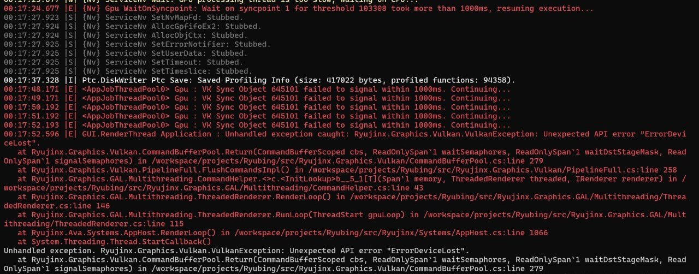

> [!NOTE]
> 
> спойлер: до сих пор нет нормального решения этой ошибки (уже как 3 года)

Цитата с Реддита:

> Это специфическая ошибка API Vulkan, и она может быть вызвана многими причинами. На данный момент её невозможно исправить. Используйте OpenGL, если ваш процессор достаточно мощный и терпим к медленной компиляции шейдеров.
>
> Удалось "исправить" ошибку, играя на базовом разрешении. Используйте SMAA Ultra и 100%-ную резкость FSR, и я не вижу никакой разницы между базовым и 2-кратным масштабированием.

Энивей, некоторым помогало:

\- Удалить русификатор

\- Обновить драйвера видеокарты или наоборот откатить обновления

\- Менять Graphics Backend на OpenGL/Vulkan (в Options -> Settings -> Graphics)

\- Убрать галочку около PPTC (в Options -> Settings -> CPU)

\- Поменять Audio Backend на SDL3/Dummy/OpenAL/SoundlO (в Options -> Settings -> Audio)

\- Открыть Ryujinx с помощью командной строки