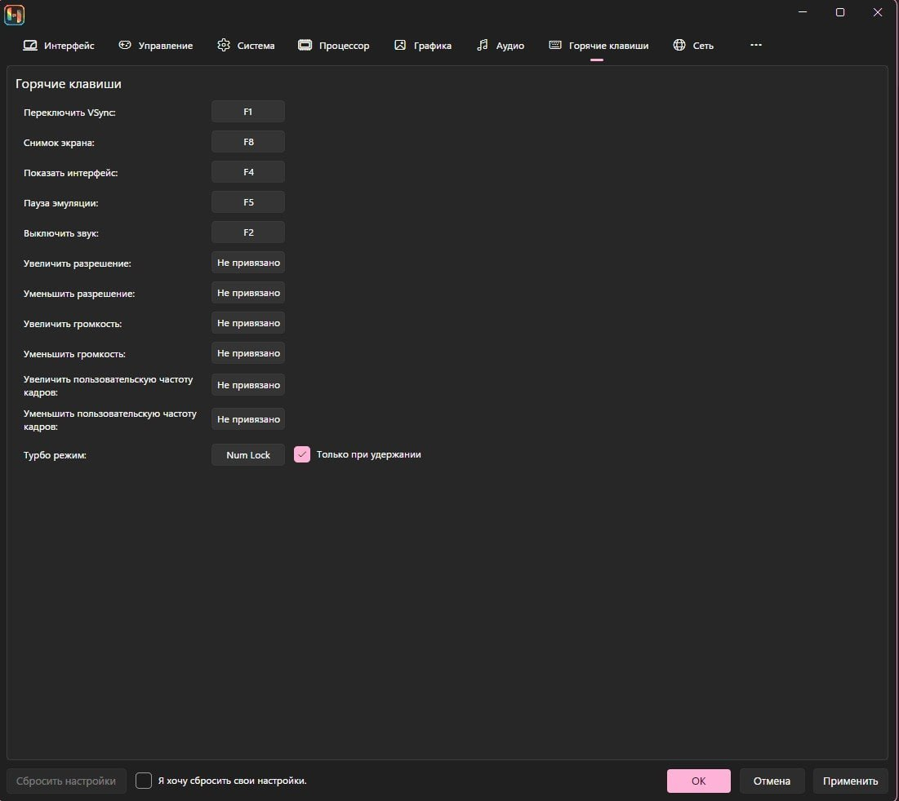

-  "игра застыла, но звук идет!" – нажимайте заданную на паузу клавишу (здесь F5)

-  "как поменять вертикальную синхронизацию?" – F1

-  "игра стала быстрой!" – F1 можно нажать несколько раз

-  "пропал звук!" – F2

-  "как включить/выключить полноэкранный режим?" – F11

-  Остальное видно на скриншоте

{width=1101px height=982px}