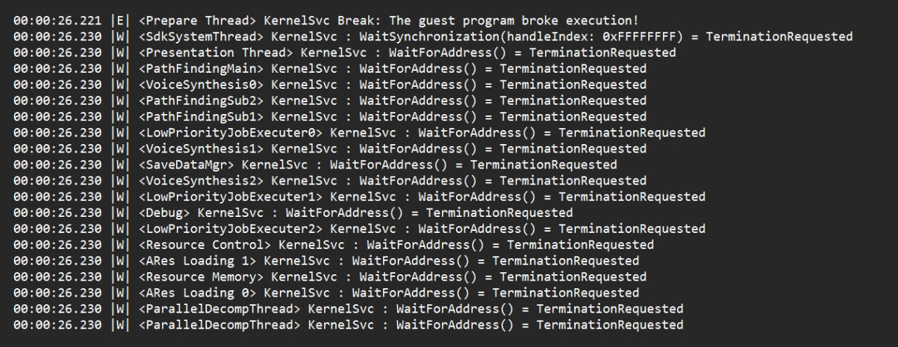

{width=1280px height=496px}

> [!WARNING]
> 
> ДЕЛАЙТЕ **МАКСИМУМ 5-6 МИИ** НА СВОЁМ ОСТРОВЕ!!!
>
> \+ ПОЧАЩЕ **ДЕЛАЙТЕ БЭКАПЫ** СЕЙВОВ

Очень часто после создания 7-го/8-го Мии игра перестаёт загружаться, вылетает с такой ошибкой. Честно, мы не знаем, поч так происходит, но таков факт. 

Можете попытаться почистить кэш, изменять графические настройки, настройки cpu, откатывать версии эмулятора, но скорее всего ничего не поможет.

Нормального адекватного решения этой проблемы нет, остаётся только удалять полностью саму папку Ryujinx:

жмём Win+R, вписываем в окошко %appdata%, жмём Enter, ищем папку ***Ryujinx*** и **удаляем её**.

После этого можно снова заходить в эмулятор, однако придётся **по новой загрузить прошивку, ключи**

Но если вы часто делали бэкапы своих сейвов, то можно удалить нынешний сейв и вместо него вернуть другой, сохранённый вами.