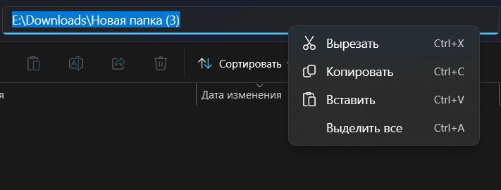
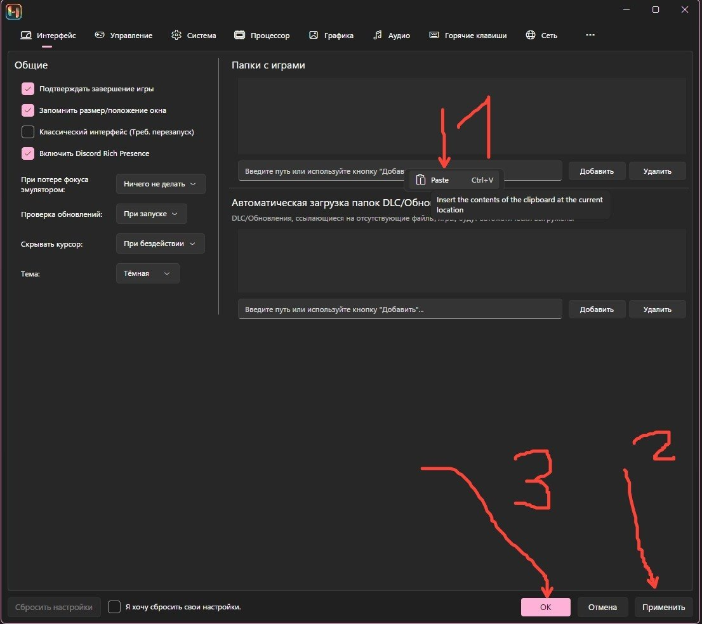

1. Создайте папку

2. Добавьте файл в папку (файл игры 6 ГБ ( или 6 миллионов КБ )

3. Заходите в папку, нажимаете ПКМ, копируете адрес ( то, что в строке ) (скриншот в п. 4)

4. 

5. Зайдите в параметры ( Options -> Settings )

6. В поле папки с играми Game directories жмите ПКМ и жмите Вставить ( Paste ), вставляете адрес папки с игрой, потом жмите применить и "ОК"

7. 