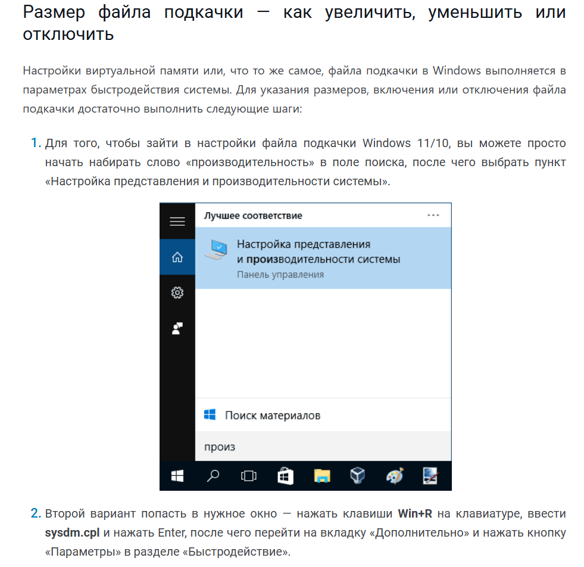
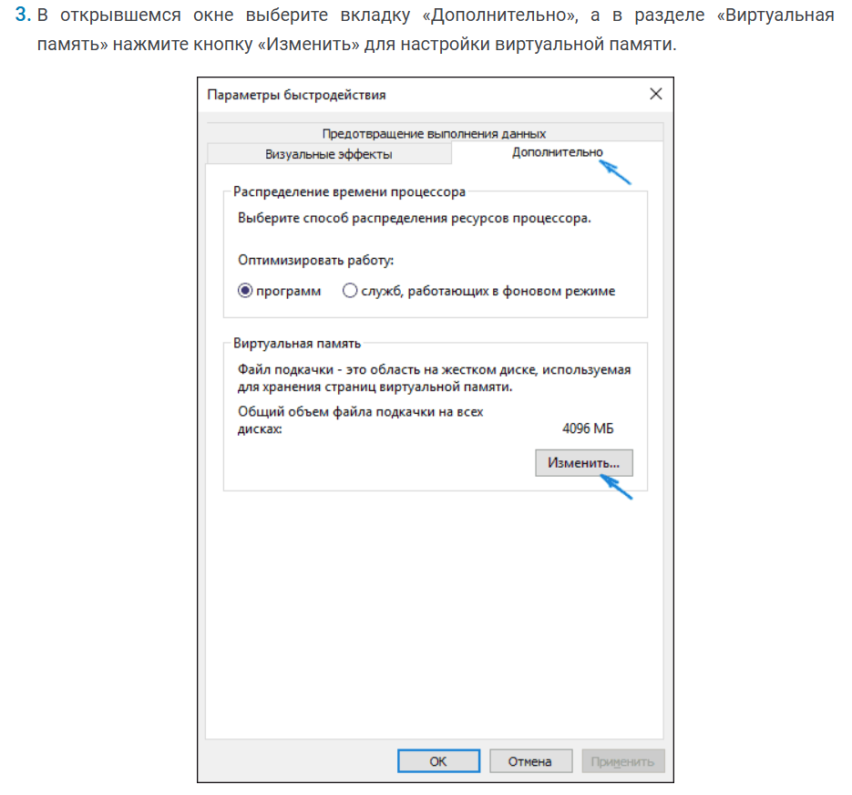
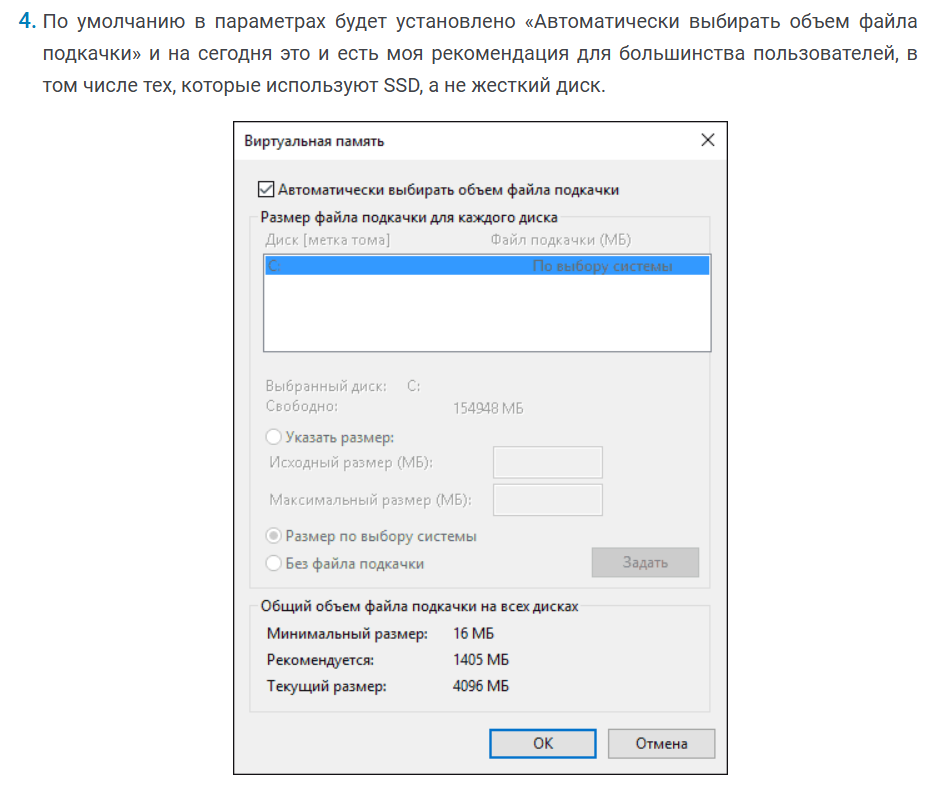
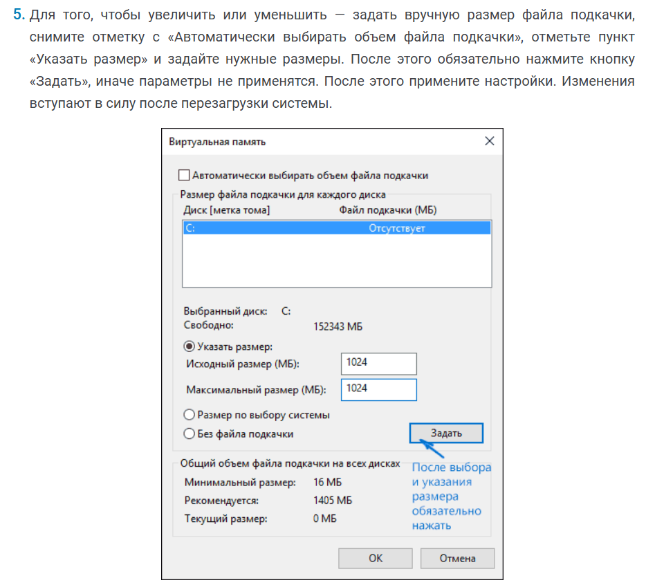
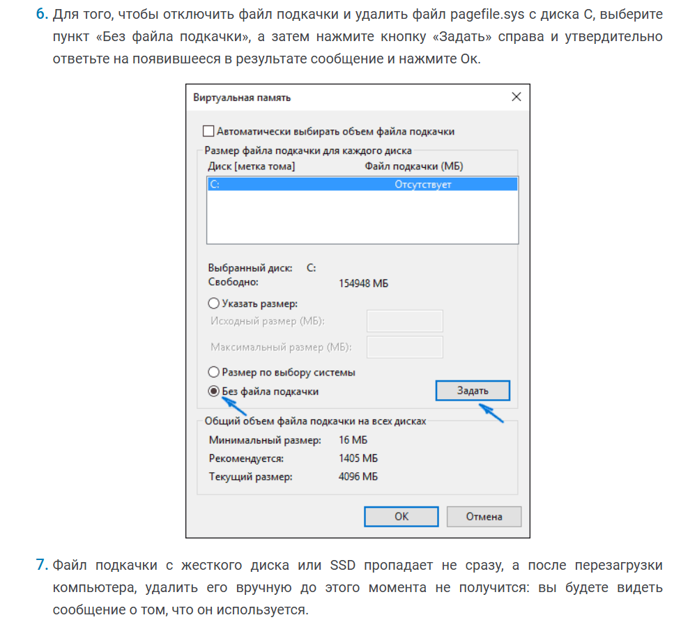
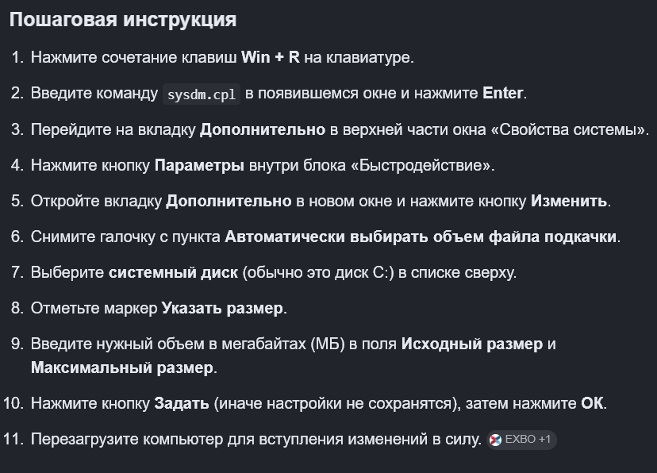

По сути тут будет копия [этой статьи](https://remontka.pro/fail-podkachki-windows/) из интернета уж извините….

> [!NOTE]
> 
> В операционных системах Windows для работы используется так называемый файл подкачки, иначе -- «виртуальная память»: своего рода расширение оперативной памяти, обеспечивающее работу программ даже в том случае, когда физической памяти RAM недостаточно. Windows 11, Windows 10 и предыдущие версии системы дополнительно могут перемещать неиспользуемые данные из оперативной памяти в файл подкачки, причем, по информации Microsoft, каждая новая версия делает это лучше.

Для решения проблем, вам, вероятно нужно будет увеличить размер этого самого файла.

## Как его изменить, если он уже есть (а он скорее всего у вас уже есть)

## Как создать, если его нет

