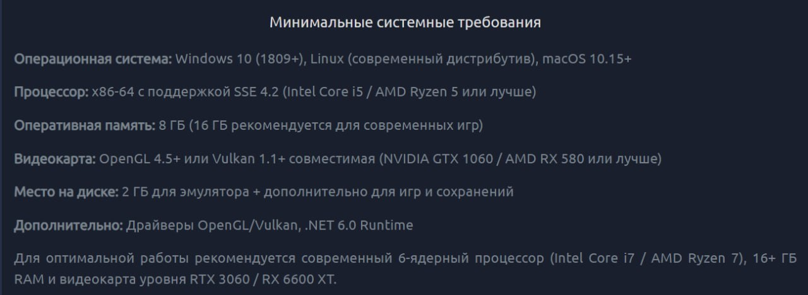
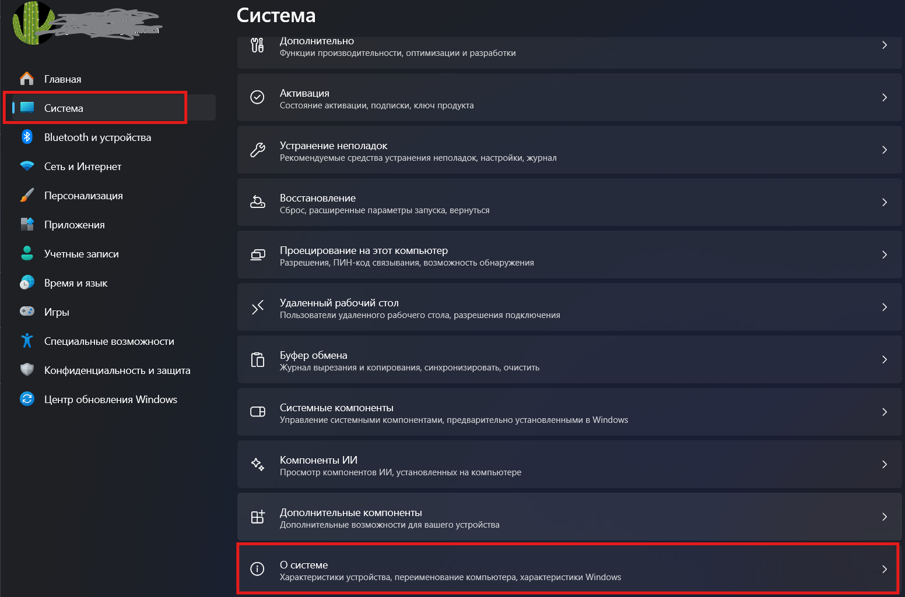
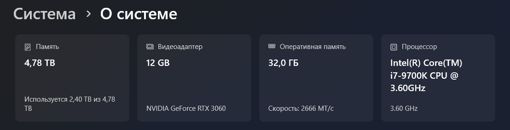
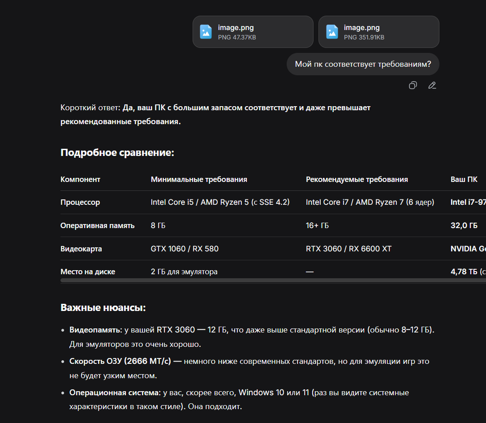

{width=1280px height=468px}

##  Как проверить соответствие требованиям на Windows 10/11

> [!NOTE]
> 
> На случай, если вы совсем ничего не понимаете

В настройках

{width=1552px height=1025px}

Делаете скриншот этого⬇️⬇️⬇️

{width=1108px height=284px}

Закидываете скриншот и фото с минимальными требованиями в дипсик или другую нейронку и спрашиваете, соответствует ли ваш пк

