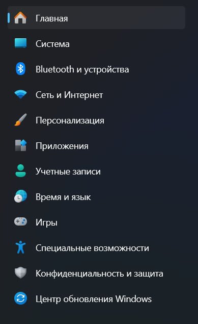

> [!NOTE]
> 
> Обновление версии системы действительно помогает решать некоторые ошибки. Например иногда *Ryujinx supports Windows 10 version 20H1 and newer*

## Windows 11

1. Зайдите в параметры системы.

2. Зайдите в пункт **Центр обновления**

3. 

4. Нажмите ***проверить наличие обновлений*** 

5. 

6. У вас автоматически начнётся скачка и установка обновлений. Дождитесь, пока они все скачаются и установятся.

7. Нажмите на кнопку **дополнительные параметры**

8. Там зайдите в ***необязательные обновления***

9. В разделе ***обновления драйверов*** поставьте все галочки и нажмите ***скачать и установить***

10. Дождитесь скачивания и установки всех их

11. Если после завершения всех установок если есть кнопка ***требуется перезагрузка***, то нажмите на неё и дождитесь перезагрузки.

12. После перезагрузки снова сделайте проверку наличия обновлений

## Windows 10

1. Зайдите в параметры

2. Обновление и безопасность

3. В Центре обновления проверьте наличие обновлений

4. Если есть такая кнопка, нажмите ***посмотреть необязательные обновления*** и выберите там все доступные

5. Дождитесь, пока все они скачаются и установятся

6. Если есть кнопка ***требуется перезагрузка***, то нажмите на неё и дождитесь перезагрузки.

7. После перезагрузки снова сделайте проверку наличия обновлений