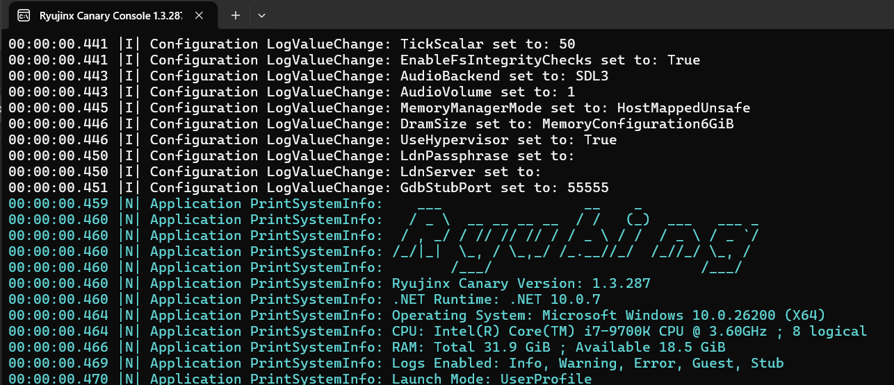

## Как узнать свою версию эмулятора

В консоли при открытии эмулятора сразу под огромной надписью написана версия

## Какая должна быть версия?

Версия ОБЯЗАТЕЛЬНО должна быть Ryujinx **Canary** и какой-либо номер. Желательно всегда ставить актуальную версию.

## Где скачать новую версию?

1. [С официального сайта](https://git.ryujinx.app/Ryubing/Canary/releases), самая новая всегда в самом верху. Вам нужен файл **ryujinx-canary-\[…\]-win_x64.zip,** на нём так же будет больше всего скачиваний.

2. Из моего [тгк или на моём гугл диске](./../osnovnaya-informaciya/_index.md#ссылки)

## Как обновить эмулятор?

Просто удалите старую папку с эмулятором и на её место скачайте новую. И всё. Все настройки сохраняются.