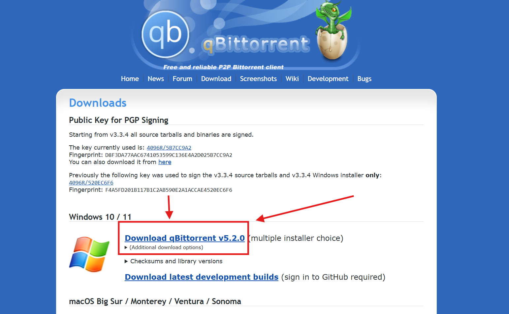
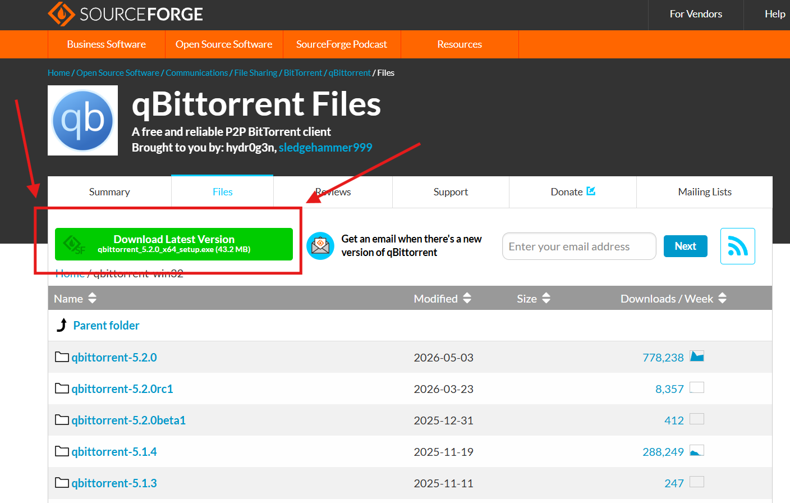
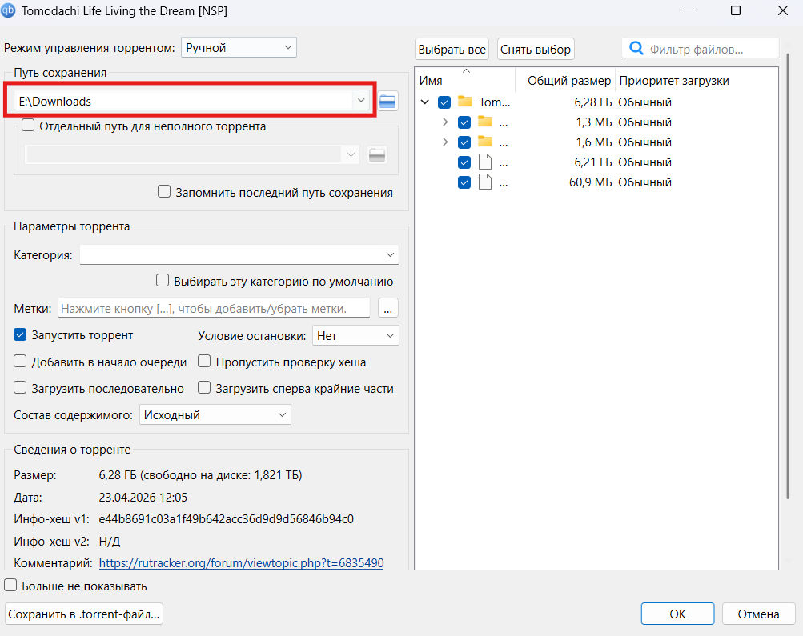
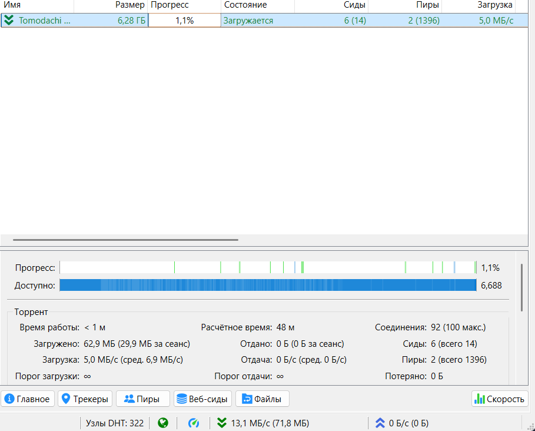
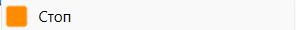

## Что вам для этого нужно:

1. Торрент клиент

2. Файл .torrent обычно весит около 17кб

## Откуда это взять?

Возможно, торрент клиент у вас уже есть. μTorrent является самым популярным торрент клиентом, и если вы уже видели у себя на компьютере эту иконку, то можете использовать его.

### Торрент клиент (если у вас его ещё нет)

Я использую qbittorrent и могу его посоветовать. Скачать его можно либо с [официального сайта](https://www.qbittorrent.org/download), либо с [моего тгк.](https://t.me/TomodachiLifeRu/51)

Вот, как скачать его с [официального сайта:](https://www.qbittorrent.org/download)

Вам скачается установщик. Запускаете его, тыкаете далее пока не закончится установка.

### Торрент файл

<https://t.me/TomodachiLifeRu/3> --Пост в моём тгк с торрент файлом. Сам файл я скачал с Рутрекера.

Так же можете скачать файл с Гугл диска. Ссылка на диск в [основной информации.](./../osnovnaya-informaciya/_index.md)

## Как установить?

1. Найдите у себя в проводнике скачанный торрент файл.

2. Кликните по нему дважды, если высвечивается окно выберите приложение, то выберите там ваш торрент клиент

3. У вас откроется окно торрент клиента, там выберите, в какую папку скачается игра и нажмите ок.

4\. Дождитесь, пока в шкале прогресс не будет значения 100%. Примерное время, за которое скачается игра написано ниже (цифра 2 на прикреплённом фото)

5\. Когда стало 100%, нажмите пкм по шкале и **«Стоп»** **{width=296px height=30px}**

Теперь у вас есть сам файл с игрой на 6гб. 2 раза нажав по шкале можно открыть папку с самим файлом игры.