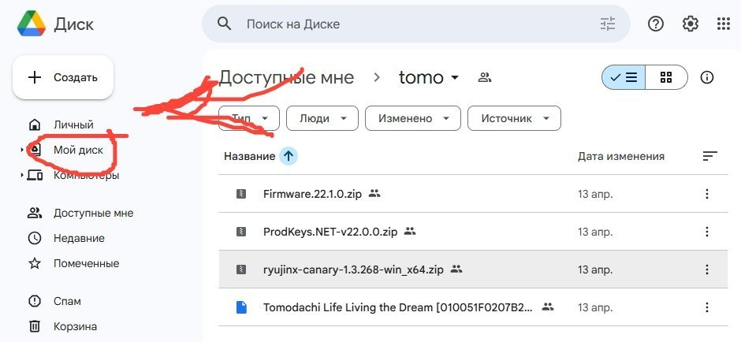
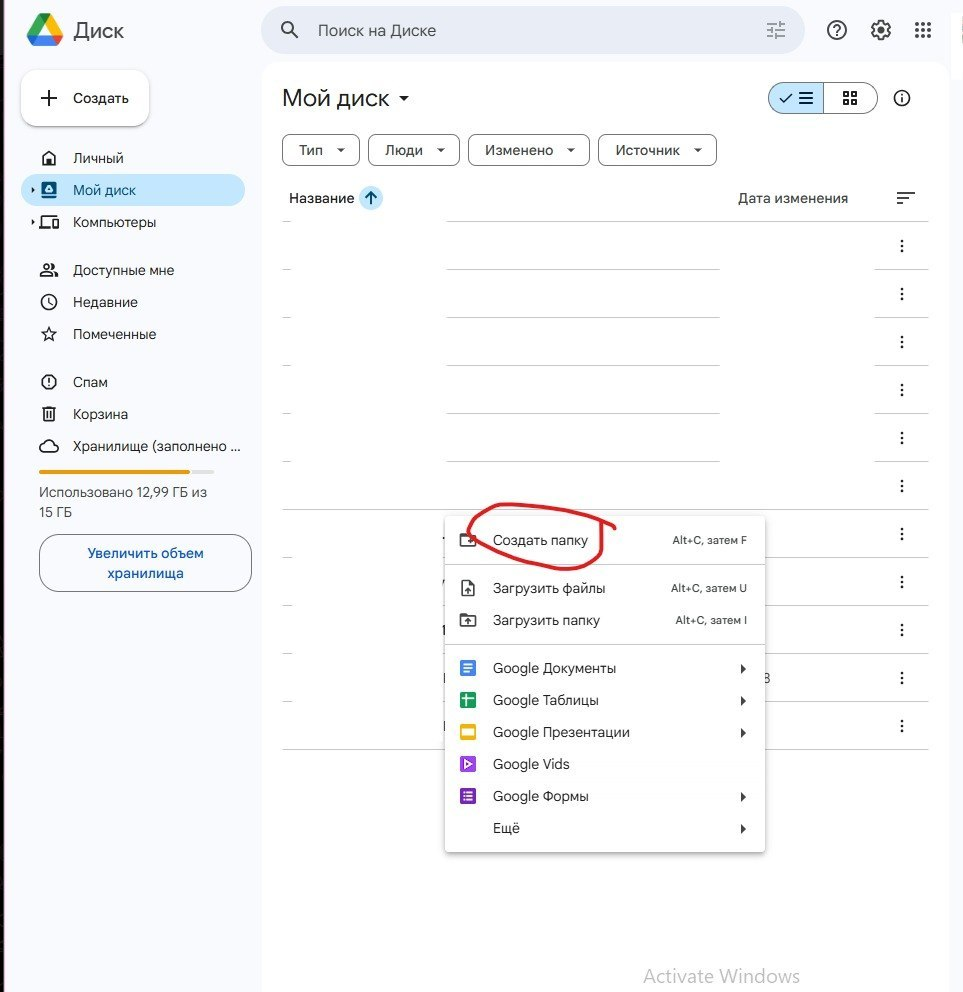
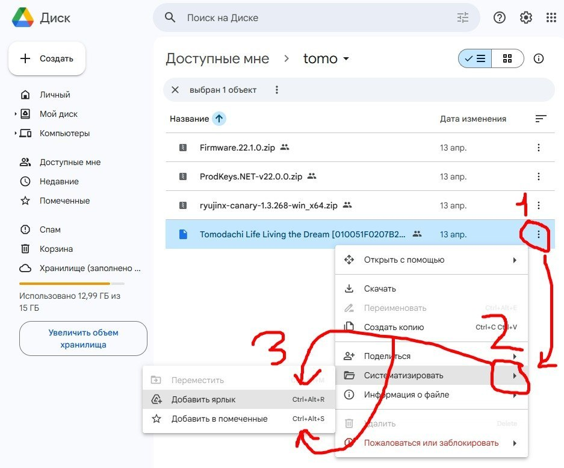
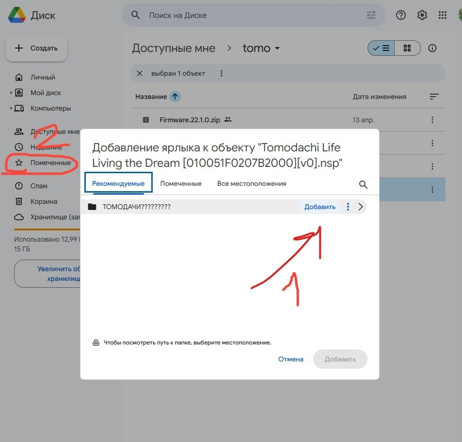
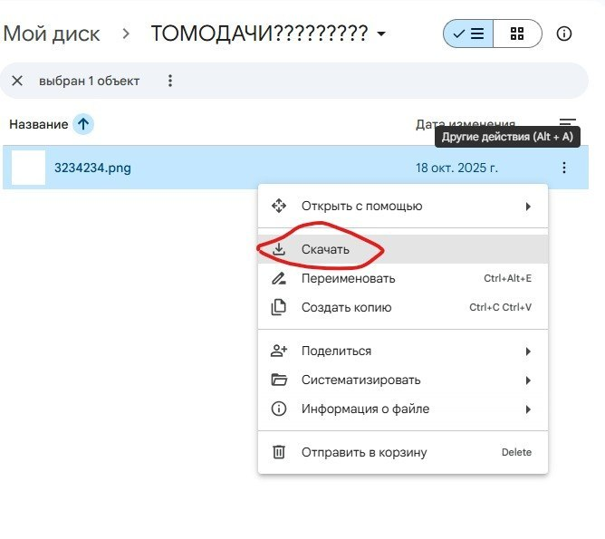

{width=940px height=434px}

Зайдите в Google Drive, затем в Мой диск

Нажав ПКМ создайте папку с любым названием

Возвращайтесь к диску, по шагам добавляйте ярлык/добавляйте в помеченные все 4 файла (либо только игру, если остальное уже есть + там могут быть обновления других файлов )

Если не получается добавить ярлык, добавляйте в "помеченные" (2) ( см. на прошлом скрине )

{width=668px height=595px}

Скачайте файлы

( Если нет ни в папке, ни в помеченных, проверяем все вкладки ("Доступные мне" например) )