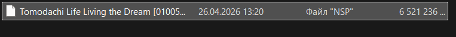

В этой статье собраны простейшие решения, которые на самом деле могут решить многие ошибки.

Например, есть проблема, когда эмулятор и игра вылетают сразу после запуска игры. Она часто случалась из-за того что люди устанавливали неправильную версию эмулятора.

## ***УДОСТОВЕРЬТЕСЬ, ЧТО ВЫ ПРАВИЛЬНО СКАЧАЛИ ЭМУЛЯТОР И ИГРУ:***

* [ ] Эмулятор должен быть именно ***Ryujinx Canary***, не просто ***Ryujinx***!!! (в консоли после огромной надписи RYUBING должно быть написано "`Ryujinx Canary Version […]` ")

* [ ] Версия эмулятора актуальная

* [ ] У вас должно быть 4 файла - ключи prod.keys, title keys, firmware, сама игра .nsp весом 6 ГБ (это 6млн КБ) {width=763px height=62px}

<note type="info">

Если же у вас файл с игрой на на 6гб, а на 17 кб, то у вас ещё не установленный торрент-файл. Как его установить [читайте тут](./momenty-ustanovki/torrenty).

</note>